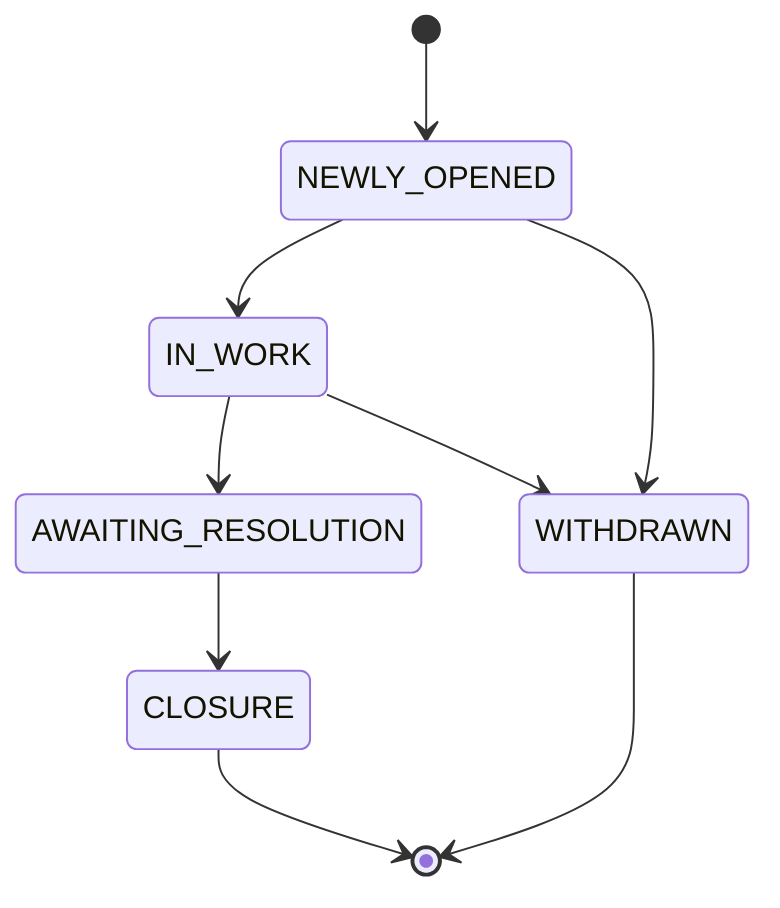

# Issue State Machine

## States

| This project | Assignment's generic name | Meaning |
|---|---|---|
| `NEWLY_OPENED` | OPEN | Ticket just created, untouched |
| `IN_WORK` | IN_PROGRESS | Someone is actively working it |
| `AWAITING_RESOLUTION` | RESOLVED | Fix proposed, awaiting confirmation/closure |
| `CLOSURE` | CLOSED | Terminal — done |
| `WITHDRAWN` | CANCELLED | Terminal — abandoned |

Names were deliberately changed from the generic OPEN/IN_PROGRESS/RESOLVED/
CLOSED/CANCELLED vocabulary (per the assignment's no-plagiarism requirement),
but the state count, structure, and every transition rule below are
functionally identical to the spec.

## Diagram

## Valid transitions

| From | To | Allowed? |
|---|---|---|
| NEWLY_OPENED | IN_WORK | ✅ |
| NEWLY_OPENED | WITHDRAWN | ✅ |
| IN_WORK | AWAITING_RESOLUTION | ✅ |
| IN_WORK | WITHDRAWN | ✅ |
| AWAITING_RESOLUTION | CLOSURE | ✅ |

## Invalid transitions (must be rejected by the backend)

| From | To | Rejected because |
|---|---|---|
| CLOSURE | anything | Terminal state |
| WITHDRAWN | anything | Terminal state |
| AWAITING_RESOLUTION | NEWLY_OPENED | No going backwards |
| AWAITING_RESOLUTION | IN_WORK | No going backwards |
| AWAITING_RESOLUTION | WITHDRAWN | Not a defined edge — must go through CLOSURE or stay put |
| IN_WORK | NEWLY_OPENED | No going backwards |
| IN_WORK | CLOSURE | Must pass through AWAITING_RESOLUTION first |
| NEWLY_OPENED | AWAITING_RESOLUTION | Can't skip IN_WORK |
| NEWLY_OPENED | CLOSURE | Can't skip IN_WORK and AWAITING_RESOLUTION |

Matches the assignment's explicit examples 1:1:
`CLOSED → OPEN`, `RESOLVED → OPEN`, `CANCELLED → OPEN` are all rejected
(as CLOSURE → NEWLY_OPENED, AWAITING_RESOLUTION → NEWLY_OPENED, WITHDRAWN →
NEWLY_OPENED here).

## Additional business rule

An issue **cannot** transition to `CLOSURE` unless it has an assignee
(`assigned_to_user_id IS NOT NULL`). This is enforced twice:

1. **Service layer** (`IssueManagementService.transitionIssueState`) — throws
   `IllegalStateException` with a clear message before touching the database.
2. **Database** (`V002__init_issue_tables.sql` CHECK constraint) — a hard
   backstop in case the service-layer guard is ever bypassed.

This was *not* in the original assignment spec — it was added after a real
bug surfaced during manual testing (closing an unassigned ticket crashed with
a raw SQL constraint violation). See
[`docs/ai-mistakes-and-fixes.md`](../docs/ai-mistakes-and-fixes.md) for the
full story — this rule is a fix for that, not a new requirement, and product
should confirm whether "must be assigned to close" is actually desired
behavior or should be relaxed.

## Implementation

- Enum: [`IssueState.java`](../backend/src/main/java/com/supportticket/common/model/IssueState.java)
  — `canTransitionTo()`, `getAllowedTransitions()`, `isModifiable()`
- Enforcement: [`IssueManagementService.transitionIssueState()`](../backend/src/main/java/com/supportticket/issue/service/IssueManagementService.java)
- Rejection path: `InvalidStateTransitionException` → HTTP 422 with the
  attempted transition and the list of allowed ones
  (see `GlobalExceptionHandler`)
- Audit trail: every transition (valid ones only — invalid attempts are
  never persisted) is recorded immutably in `state_change_log`
  (from → to, who, when, why)

## Test coverage

`IssueStateTransitionTest.java` (16 cases): all 5 valid transitions +
all 9 invalid transitions enumerated above + read-only/terminal-state
checks + `getAllowedTransitions()` correctness.

`IssueManagementIntegrationTest.java`: exercises the full valid path
NEWLY_OPENED → IN_WORK → AWAITING_RESOLUTION → CLOSURE against a real
database, plus asserts an invalid transition throws.
